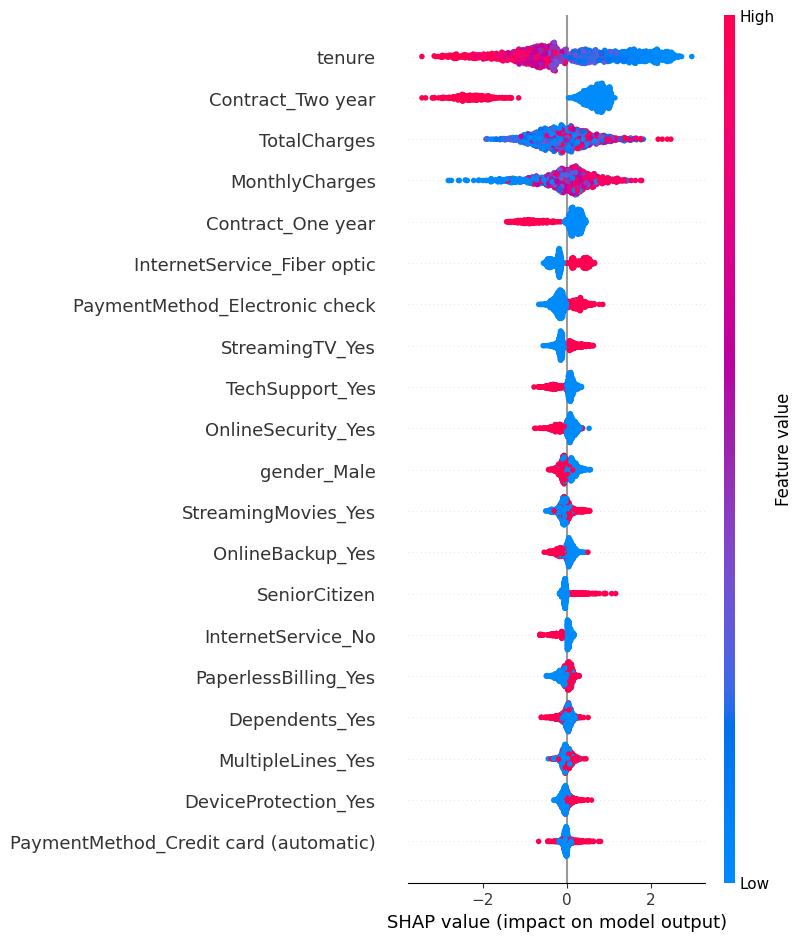

# 🫠 Telco Customer Churn Prediction

A complete machine learning project to **predict customer churn** for a telecommunications company. This project showcases a full pipeline from data preprocessing, exploratory data analysis, model training (default, tuned, weighted, SMOTE), to SHAP-based interpretation.

[🔗 GitHub Repository](https://github.com/jayakishanMinnekanti/telco_churn_prediction)

---

## 📌 Project Overview

This project aims to:

* Understand customer behavior and churn trends
* Apply multiple ML approaches to predict churn
* Interpret predictions using SHAP values
* Suggest business strategies based on findings

---

## 📁 Folder Structure

```bash
telco_churn_prediction/
│
├── data/                            # 📅 Raw dataset
│   └── data.csv
│
├── outputs/                         # 🔍 All generated outputs
│   ├── models/                      # 📊 Saved ML models (.pkl)
│   └── plots/                       # 📈 SHAP summary plots
│
├── src/                             # 🤖 Source code
│   ├── data/
│   │   ├── load_data.py             # Load dataset
│   │   └── preprocess.py            # Clean and encode data
│   │
│   ├── model/
│   │   ├── train_default.py         # Default XGBoost model
│   │   ├── train_tuned.py           # GridSearch tuned model
│   │   ├── train_weighted.py        # Class-weighted model
│   │   └── train_smote.py           # SMOTE-balanced model
│   │
│   ├── interpret/
│   │   └── shap_analysis.py         # SHAP explanation code
│   │
│   └── utils/
│       └── save_model.py            # Save model helper
│
├── notebooks/                       # 📓 Jupyter Notebook
│   └── main.ipynb                   # Full pipeline walkthrough
│
├── main.py                          # 🚀 Project entry point
├── requirements.txt                 # 📦 Project dependencies
├── LICENSE                          # 🛡 MIT License
├── SECURITY.md                      # 🔒 Security reporting info
└── README.md                        # 📘 Documentation
```

---

## 📈 Dataset Overview

Source: [Kaggle - Telco Customer Churn](https://www.kaggle.com/blastchar/telco-customer-churn)

This dataset consists of 7043 rows and 21 columns:

| Column                                                                                                | Description                                 |
| ----------------------------------------------------------------------------------------------------- | ------------------------------------------- |
| `customerID`                                                                                          | Unique customer identifier                  |
| `gender`                                                                                              | Male / Female                               |
| `SeniorCitizen`                                                                                       | 1 if senior citizen, 0 otherwise            |
| `Partner`                                                                                             | Whether the customer has a partner          |
| `Dependents`                                                                                          | Whether the customer has dependents         |
| `tenure`                                                                                              | Number of months with the company           |
| `PhoneService`                                                                                        | Whether the customer has phone service      |
| `MultipleLines`                                                                                       | Whether the customer has multiple lines     |
| `InternetService`                                                                                     | DSL, Fiber optic, or No                     |
| `OnlineSecurity`, `OnlineBackup`, `DeviceProtection`, `TechSupport`, `StreamingTV`, `StreamingMovies` | Internet-related services                   |
| `Contract`                                                                                            | Month-to-month, One year, Two year          |
| `PaperlessBilling`                                                                                    | Whether the customer uses paperless billing |
| `PaymentMethod`                                                                                       | Payment type used                           |
| `MonthlyCharges`                                                                                      | The amount charged monthly                  |
| `TotalCharges`                                                                                        | Total amount charged                        |
| `Churn`                                                                                               | Target variable (Yes = 1, No = 0)           |

---

## 🔍 Exploratory Data Analysis (EDA)

* Churn rate is about 26.5% of total customers.
* Customers with month-to-month contracts showed the **highest churn**.
* **Senior citizens**, and **fiber optic users** had relatively high churn.
* Churners had **shorter tenure** and **higher monthly charges**.
* Customers without **online security** or **tech support** were more likely to churn.

---

## 🎯 Modeling Steps

### 1. Data Preprocessing

* Dropped `customerID`
* Converted `TotalCharges` to numeric
* Encoded `Churn` as binary (Yes=1, No=0)
* One-hot encoded categorical columns
* Stratified train-test split (80/20)

### 2. Models Built

* ✅ **Default XGBoost** (baseline)
* ⚖️ **GridSearch Tuned Model** (hyperparameter optimization)
* ⚠️ **Class Weighted XGBoost** (balanced learning)
* 🏋️ **SMOTE XGBoost** (oversampling minority class)

Each model was evaluated using:

* **Confusion Matrix**
* **Classification Report** (Precision, Recall, F1-score)

### 3. SHAP Interpretation

* Used class-weighted model
* Explained global feature importance
* Generated and saved summary plot with top 20 drivers

---

## 📊 Findings & Business Recommendations

### 🔍 Insights:

* Customers with **low tenure** (under 6 months) are highly prone to churn.
* **Month-to-month contracts** correlate strongly with churn; long-term contracts help retain.
* **High monthly charges** combined with **low services** (no security, no tech support) frustrate customers.
* **Fiber optic** internet is associated with more churn—possibly due to price or technical issues.

### 💡 Strategic Actions:

* Offer **retention discounts** during the first 6 months of a new contract.
* Provide **tech support or online security** as free perks in early customer lifecycle.
* Promote **annual or biennial contracts** with better pricing models.
* Investigate reasons behind **fiber optic dissatisfaction** (pricing, reliability).
* Use predictive churn scoring to flag at-risk customers and engage them early.

---

## 🚀 Quick Start

```bash
# Step 1: Clone
https://github.com/jayakishanMinnekanti/telco_churn_prediction.git
cd telco_churn_prediction

# Step 2: Install dependencies
pip install -r requirements.txt

# Step 3: Run the full pipeline
python main.py

# Step 4: View SHAP plot
open outputs/plots/shap_summary_plot.png
```

---

## 📊 Sample SHAP Plot



---

## 🔧 Requirements

```text
xgboost
shap
matplotlib
seaborn
scikit-learn
pandas
numpy
jupyter
```

---

## 🔒 Security

See [SECURITY.md](./SECURITY.md) for how to report vulnerabilities.

---

## 🛡 License

This project is under the [MIT License](LICENSE).
You're free to use, modify, and distribute it with credit to the original author.

---

## 🙌 Author & Credits

### 👤 Author

**Name**: Jayakishan Minnekanti  
**Email**: [contact@jayakishan.com](mailto:contact@jayakishan.com)  
**LinkedIn**: [linkedin.com/in/minnekanti](https://linkedin.com/in/minnekanti)

---

### 🎁 Data Source

This project uses the **Telco Customer Churn** dataset available on **Kaggle**:  
🔗 [Kaggle - Telco Customer Churn](https://www.kaggle.com/blastchar/telco-customer-churn)

Credit goes to the original data provider for making this public and accessible.

---

### ⭐ Show Your Support

If you found this project helpful or insightful:

- Give it a ⭐ on GitHub
- Connect with me on [LinkedIn](https://linkedin.com/in/minnekanti)
- Share with others in the Data Science community!

Together, let's reduce churn and increase retention—one model at a time. 🚀

---
